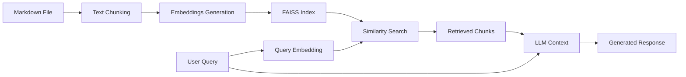

# SimplyRAGv3


> [!NOTE]
> Coded to life with some help from Claude 4 Opus

SimplyRAGv3 is a learning project that demonstrates the core concepts of RAG (Retrieval-Augmented Generation) through a practical application. It allows you to upload Markdown documents and have intelligent conversations about their contents using various LLM backends.

Built as a hands-on way to understand:
- Document chunking and embedding generation
- Vector similarity search
- Context retrieval and augmented generation
- Multi-model LLM integration

## Features

- 📄 **Markdown File Support** - Upload and process `.md` files
- 🔍 **Semantic Search** - Find relevant content using vector embeddings
- 🤖 **Multiple LLM Backends**
  - OpenAI API
  - Google Gemini
  - GitHub Models
  - Local models via LM Studio
- ⚡ **Local Embeddings** - Uses Sentence-Transformers for privacy and speed
- 💾 **FAISS Vector Store** - Efficient similarity search
- 🎛️ **Configurable Parameters** - Adjust chunk size, overlap, and retrieval count
- 💬 **Chat Interface** - Clean Streamlit-based conversational UI

## Installation

### Prerequisites
- Python 3.8 or higher
- pip package manager

### Quick Start

1. **Clone the repository**
   ```bash
   git clone https://github.com/LazySeaHorse/SimplyRAGv3.git
   cd SimplyRAGv3
   ```

2. **Create a virtual environment** (recommended)
   ```bash
   python -m venv venv
   
   # Activate virtual environment
   # On macOS/Linux:
   source venv/bin/activate
   
   # On Windows:
   venv\Scripts\activate
   ```

3. **Install dependencies**
   ```bash
   pip install -r requirements.txt
   ```

4. **Set up environment variables**
   
   Edit `.env` and add your API keys:
   ```env
   OPENAI_API_KEY=your-openai-key
   GOOGLE_API_KEY=your-gemini-key
   GITHUB_TOKEN=your-github-token
   ```

5. **Run the application**
   ```bash
   streamlit run app.py
   ```

   The app will open automatically in your browser at `http://localhost:8501`

## Usage

1. **Upload a Markdown File**
   - Click the file uploader in the sidebar
   - Select a `.md` file from your computer

2. **Choose Your Model**
   - Select from OpenAI, Gemini, GitHub Models, or LM Studio
   - Make sure you've configured the corresponding API key

3. **Process the Document**
   - Click "Process File" to chunk and index your document
   - Wait for the success message showing chunk count

4. **Start Chatting**
   - Type questions in the chat input
   - The app will retrieve relevant context and generate answers
   - View retrieved chunks in the expandable section

## ⚙️ Configuration

### Model Providers Setup

<details>
<summary><b>OpenAI Setup</b></summary>

1. Get API key from [OpenAI Platform](https://platform.openai.com/api-keys)
2. Add to `.env`: `OPENAI_API_KEY=sk-...`
3. Choose model
</details>

<details>
<summary><b>Google Gemini Setup</b></summary>

1. Get API key from [Google AI Studio](https://makersuite.google.com/app/apikey)
2. Add to `.env`: `GOOGLE_API_KEY=...`
3. Default model
</details>

<details>
<summary><b>GitHub Models Setup</b></summary>

1. Create token at [GitHub Settings](https://github.com/settings/tokens)
2. Add to `.env`: `GITHUB_TOKEN=ghp_...`
3. Requires GitHub Copilot subscription
</details>

<details>
<summary><b>LM Studio Setup</b></summary>

1. Download [LM Studio](https://lmstudio.ai/)
2. Load a model and start local server
3. Default endpoint: `http://localhost:1234/v1`
</details>

## 🧠 How It Works

### RAG Pipeline



1. **Document Processing**
   - Splits Markdown into overlapping chunks
   - Generates embeddings using Sentence-Transformers
   - Stores vectors in FAISS for fast retrieval

2. **Query Processing**
   - Embeds user question
   - Finds top-K similar chunks
   - Constructs context for LLM

3. **Response Generation**
   - Sends context + query to selected LLM
   - Returns contextually relevant answer

## 📁 Project Structure

```
SimplyRAGv3/
├── app.py              # Main Streamlit application
├── config.py           # Configuration management
├── vectorstore.py      # Vector store and retrieval logic
├── llm_manager.py      # LLM integration handlers
├── requirements.txt    # Python dependencies
├── .env.example        # Environment variables template
└── README.md          # This file
```

## 🛠️ Technical Stack

- **Frontend**: Streamlit
- **Embeddings**: Sentence-Transformers (all-MiniLM-L6-v2)
- **Vector Store**: FAISS
- **LLMs**: OpenAI, Google Gemini, GitHub Models, LM Studio
- **Language**: Python 3.8+

## 🎯 Future Ideas

- [ ] Support for more file formats (PDF, TXT, DOCX)
- [ ] Persistent vector storage
- [ ] Multi-document chat
- [ ] Streaming responses
- [ ] Chat export functionality
- [ ] Better chunk visualization
- [ ] Hybrid search (keyword + semantic)

## 📄 License

This project is open source and available under the [MIT License](LICENSE).
